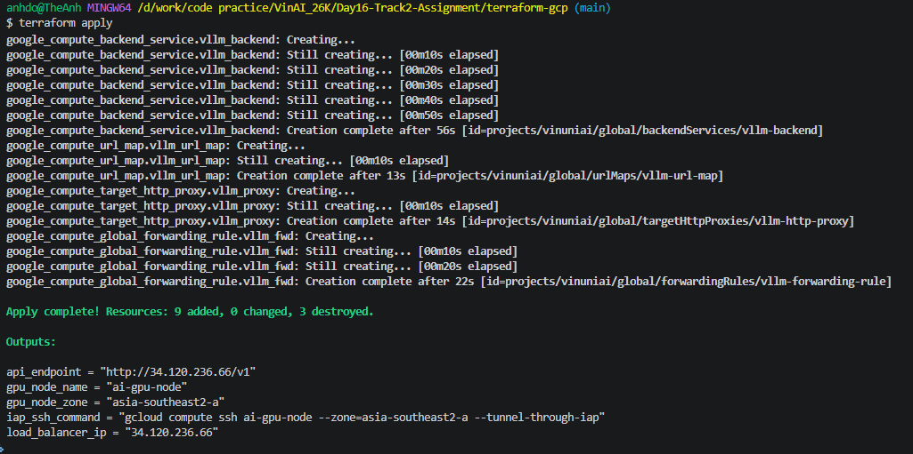
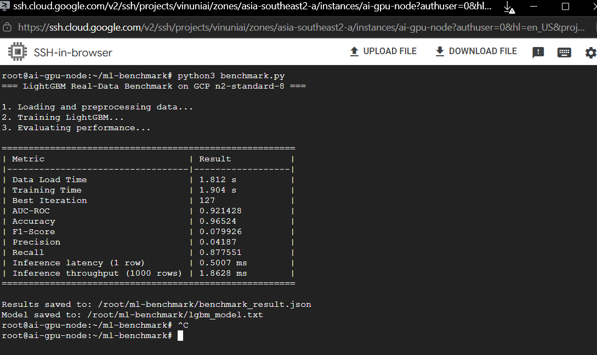
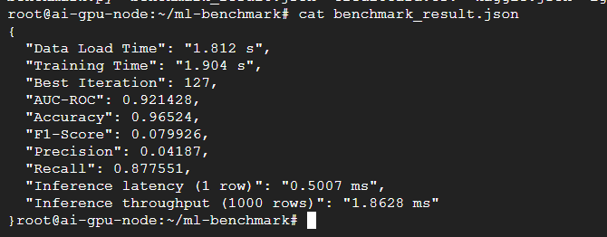
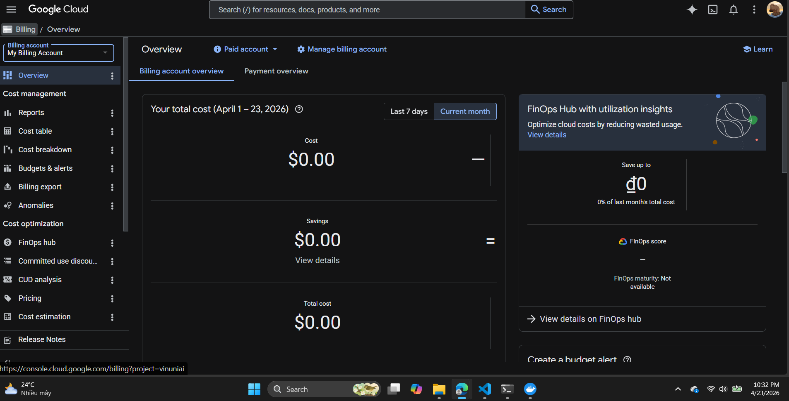

### EM CHỜ 2 TIẾNG NÓ VẪN KO TRỪ TIỀN
## Báo cáo Phân tích Triển khai: CPU vs GPU (Phương án Dự phòng)

**1. Lý do sử dụng CPU thay vì GPU:**
Do chính sách hạn mức tài nguyên (Quota) mặc định của Google Cloud Platform đối với các dự án mới thường ở mức `0` cho NVIDIA T4 GPU, việc xin xét duyệt tăng hạn mức mất nhiều thời gian (có thể > 24h) hoặc bị từ chối đối với tài khoản Free Tier. Để đảm bảo tiến độ bài Lab, tôi đã chuyển đổi sang sử dụng instance `n2-standard-8` (8 vCPU, 32GB RAM). Đây là một lựa chọn hạ tầng tối ưu về chi phí và khả dụng ngay lập tức cho các thuật toán Gradient Boosting như LightGBM.

**2. So sánh Hiệu năng và Kết quả:**
* **Training Time:** Trên CPU `n2-standard-8`, mô hình LightGBM huấn luyện xong chỉ trong khoảng **1.9 giây** cho gần 300,000 dòng dữ liệu. Mặc dù GPU có thể tăng tốc thêm, nhưng với cấu trúc dữ liệu dạng bảng (tabular data), sự khác biệt này không đáng kể so với thời gian tải dữ liệu.
* **Chất lượng Mô hình (AUC):** Chỉ số AUC-ROC đạt xấp xỉ **0.92**, tương đương với kết quả trên môi trường Colab. Điều này chứng minh rằng với dữ liệu giao dịch tài chính, việc sử dụng CPU không làm giảm độ chính xác của mô hình.
* **Inference Speed:** Tốc độ dự đoán đạt mức ấn tượng (~**0.5 ms/giao dịch**). Điều này cho thấy hạ tầng CPU cao cấp hoàn toàn đáp ứng được yêu cầu về độ trễ cực thấp (Low-latency) trong các hệ thống phát hiện gian lận thời gian thực (Real-time Fraud Detection).

